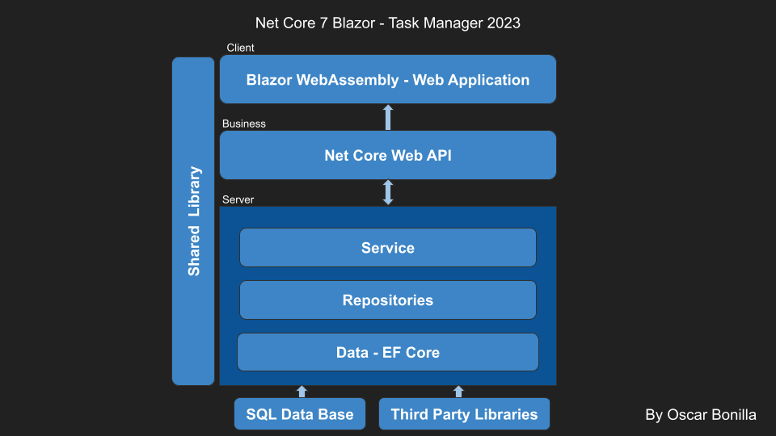

# .NET Core 7 Blazor Task Manager Sample

# Task Management Project

The **Task Management Project** is designed to help you manage tasks.

## Features

- Create new tasks.
- Modify existing tasks.
- Delete tasks when they're completed.

This project provides a streamlined way to handle your tasks.

Welcome to the **.NET Core 7 Blazor Task Manager Sample** repository. This project serves as a small-scale example for creating larger-scale projects, like N-Tier projects. It showcases the implementation of various architectural patterns and technologies.

## EF Core Dependencies
<details>
  <summary>Windows</summary>

  * Microsoft.EntityFrameworkCore
  * Microsoft.EntityFrameworkCore.Design
  * Microsoft.EntityFrameworkCore.SqlServer
  * Microsoft.EntityFrameworkCore.Tools -> To Support Commands on Windows

</details>

<details>
  <summary>Mac</summary>

  * Microsoft.EntityFrameworkCore
  * Microsoft.EntityFrameworkCore.Design
  * Microsoft.EntityFrameworkCore.SqlServer
  * **To support commands on Mac OS please install** [Entity Framework Core tools reference - .NET Core CLI](https://learn.microsoft.com/en-us/ef/core/cli/dotnet)
</details>

## Project Overview

This project is designed using a **Layered Architecture** with the following layers:

- **Data Layer**: Responsible for data access and database interactions using Entity Framework Core.
- **Repository Layer**: Implements the Repository Pattern, providing an abstraction over data access.
- **Services Layer**: Contains business logic and services for managing tasks.
- **Shared Layer**: Contains shared models, utilities, and common functionalities.



The architecture also encompasses the following:

- **Repository Pattern**: Offers a structured approach to data access and separation of concerns.
- **Specification Pattern**: Enables dynamic query construction and filtering.
- **Dependency Injection**: Utilizes DI for loose coupling and easy testability.
- **Entity Framework Core First**: Adopts EF Core's Code-First approach for database management.
- **Web API Backend**: Implements a Web API for backend operations.
- **Blazor WebAssembly Frontend**: Provides an interactive user interface using Blazor.

## Requirements

- [.NET Core 7 SDK](https://dotnet.microsoft.com/download/dotnet/7.0)
- Modern web browser compatible with Blazor WebAssembly

## Cloning and Installation

To run this project on your local machine, follow these steps:

1. Clone the repository to your local machine:
   ```shell
   git clone https://github.com/DevOBR/net-core-7-blazor-task-manager-2023.git
   
2. Navigate to the project folder:
    ```shell
    cd net-core-7-blazor-task-manager-2023

3. Update and create the database by executing Entity Framework's database update command:
    ```shell
    dotnet ef database update --startup-project=TaskManager.Backend --project TaskManager.Data
    
5. In case you need to recreate the init migration should execute the next command:
  ```shell
  dotnet ef migrations add InitialDb --startup-project=TaskManager.Backend --project TaskManager.Data


4. Run the application:
    ```shell
    dotnet run
